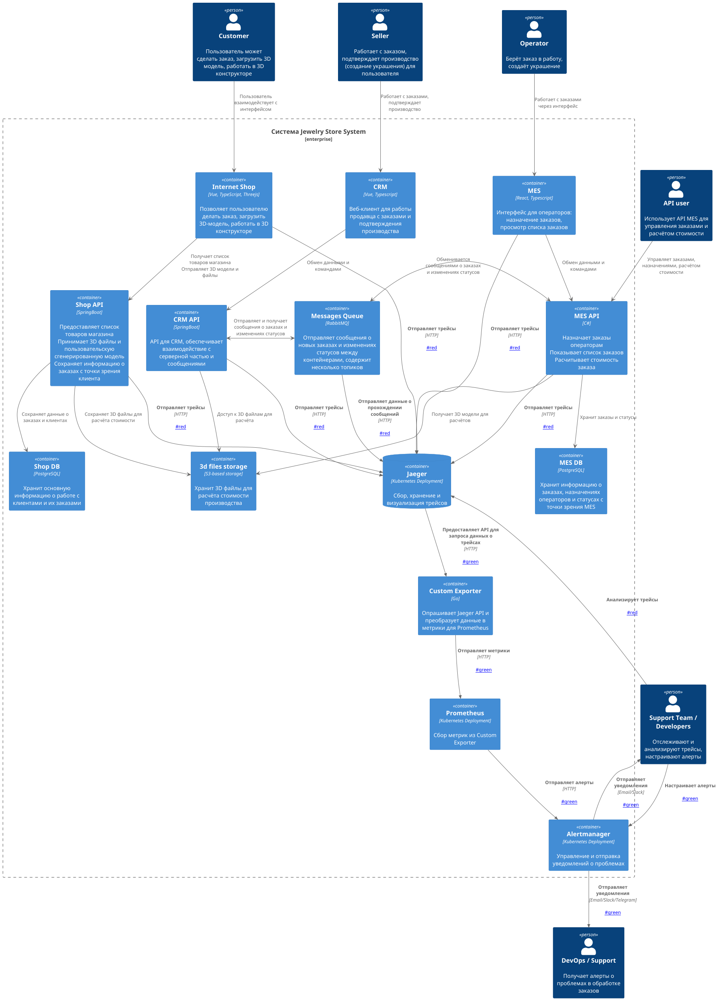
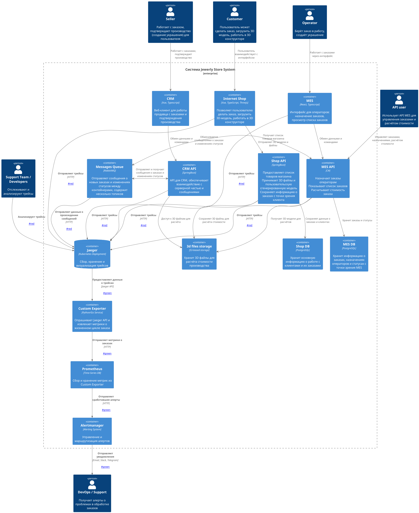

# Архитектурное решение по трейсингу

---

## Мотивация

В настоящий момент в системе «Александрит» отсутствует прозрачность в отслеживании жизненного цикла заказов. Это приводит к ситуациям, когда заказы:  
- подвисают на промежуточных этапах без объяснения причин,  
- теряются при передаче между сервисами,  
- не доходят до обработки, хотя пользователи и партнёры уверены, что они были отправлены.  

В результате компания сталкивается с рядом проблем:  
- **Рост жалоб** от клиентов и партнёров по API,  
- **Снижение доверия** и возможные расторжения контрактов,  
- **Перегрузка службы поддержки**, которая вынуждена вручную искать статусы заказов,  
- **Увеличение времени диагностики инцидентов**, так как инженеры не видят сквозной картины.  

Внедрение системы распределённого трейсинга позволит обеспечить **сквозное наблюдение** за процессом обработки заказа. Это даст:  
- сокращение времени диагностики,  
- возможность выявлять и устранять узкие места,  
- повышение прозрачности для клиентов и партнёров,  
- автоматизацию мониторинга и алертинга,  
- улучшение SLA и доверия к бренду.  

### Метрики, на которые повлияет трейсинг

1. **Среднее время устранения инцидентов (MTTR)** — благодаря полной картине быстрее находится точка отказа.  
2. **Количество потерянных заказов** — появится возможность выявлять и предотвращать зависшие процессы.  
3. **Среднее время прохождения заказа по цепочке** — позволит находить и оптимизировать медленные этапы.  
4. **Количество обращений в поддержку по статусу заказа** — снизится за счёт прозрачной системы трейсинга.  
5. **Индекс удовлетворённости клиентов (NPS)** — прозрачность работы улучшает доверие к компании.  

---

## Анализ системы: где возможны сбои

Жизненный цикл заказа в системе «Александрит» может прерываться или задерживаться на следующих этапах:

1. **Отправка из интернет-магазина (`INITIATED → SUBMITTED`)**  
   - Потеря данных корзины, ошибка фронтенда, сбой в Shop API.  

2. **Передача заказа в MES (`SUBMITTED → PRICE_CALCULATED`)**  
   - Проблемы с RabbitMQ (потеря или задержка сообщений).  

3. **Переход в CRM (`PRICE_CALCULATED → MANUFACTURING_APPROVED`)**  
   - Задержка отображения заказа, невозможность подтверждения.  

4. **Запуск производства (`MANUFACTURING_APPROVED → MANUFACTURING_STARTED`)**  
   - Задержки отображения у оператора, проблемы с уведомлениями.  

5. **Завершение производства (`MANUFACTURING_STARTED → COMPLETED`)**  
   - Ошибка в производственном процессе, проблемы с обновлением статуса.  

6. **Работа с 3D-моделью (S3 Storage)**  
   - Повреждение или невозможность загрузки модели.  

7. **Очереди RabbitMQ**  
   - Сообщения теряются, потребители падают, нет повторной обработки.  

8. **Внешние заказы через API**  
   - Неправильный формат, отсутствие ID, сбои авторизации.  

---

## Данные, которые должны попадать в трейсинг

Для корректной диагностики необходимо фиксировать:  

- **trace_id** — уникальный идентификатор цепочки;  
- **span_id** — идентификатор конкретного шага;  
- **order_id** — уникальный ID заказа;  
- **status** — текущий статус заказа;  
- **service.name** — имя сервиса, выполняющего операцию;  
- **timestamp** — время начала и завершения шага;  
- **duration** — длительность выполнения;  
- **customer_id / user_id** — участники процесса;  
- **характеристики 3D-модели** — размер, количество полигонов;  
- **calculation_time** — время расчёта стоимости;  
- **source** — источник заказа (`b2c`, `api`);  
- **error.message / error.type** — описание ошибок;  
- **связанные логи** уровня warning/error.  

---

## Предлагаемое решение

### Технологический стек

- **OpenTelemetry** — единый стандарт сбора трейсов;  
- **Jaeger** — система хранения и визуализации трейсов;  
- **OTLP (OpenTelemetry Protocol)** — протокол обмена данными;  
- **Jaeger Agent + Collector** — сбор и буферизация данных;  
- **RabbitMQ Tracer Plugin** — для отслеживания сообщений в очередях.  

### Интеграция с компонентами

1. **Интернет-магазин (Vue + Spring Boot)**  
   - Подключение JS SDK для фронтенда и Java SDK для backend.  

2. **Shop API / CRM API (Spring Boot)**  
   - Автоматическое инструментирование через Java Agent.  

3. **MES API (C#)**  
   - Подключение .NET SDK, ручное добавление спанов.  

4. **MES UI (React)**  
   - Включение JS SDK для клиентских операций.  

5. **RabbitMQ**  
   - Внедрение плагина для трейсинга сообщений.  

6. **3D-хранилище (S3)**  
   - Оборачивание клиентских вызовов в middleware с записью трейсов.  

### Новые компоненты на схеме

- **Jaeger Agent** (развёрнут на серверах),  
- **Jaeger Collector**,  
- **Jaeger Query (UI)**,  
- **Custom Exporter** (преобразует трейсы в метрики для Prometheus).  

**Новые связи (отмечаются красным на диаграмме):**  
- Каждый сервис → Jaeger Agent → Jaeger Collector → Jaeger Query.  
- RabbitMQ → Jaeger Agent.  
- Jaeger API → Custom Exporter → Prometheus.  

---

## Автоматический мониторинг и алертинг (доп. задание)

На основе трейсинга можно построить дополнительный мониторинг:  

1. **Custom Exporter**  
   - Опрос Jaeger API, преобразование трейсов в метрики (длительность, ошибки, «зависшие» заказы).  

2. **Prometheus**  
   - Хранение собранных метрик.  

3. **Grafana**  
   - Дашборды: скорость обработки заказов, количество ошибок, «бутылочные горлышки».  

4. **Alertmanager**  
   - Настройка уведомлений по ключевым условиям.  

**Примеры алертов:**  
- Заказ завис > 15 минут на этапе → Slack DevOps.  
- Статус `PRICE_CALCULATED` без изменений > 10 минут → Email.  
- Заказ в производстве > 2 часов → создание тикета в Jira.  
- Потеря сообщений в RabbitMQ > 100 → Telegram.  

**На диаграмме зелёным цветом** отражаются компоненты мониторинга (Exporter, Prometheus, Grafana, Alertmanager).  

---

## Компромиссы

- **Стоимость внедрения** — потребуется модернизация всех backend-сервисов и сопровождение новой инфраструктуры.  
- **Нагрузка на производительность** — сбор трейсов требует ресурсов; решается сэмплингом (например, 10% запросов).  
- **Интеграция со старым кодом** — возможны трудности при работе с legacy.  
- **Ограничения сторонних систем** — внешние сервисы могут не поддерживать OpenTelemetry.  
- **Работа с S3** — потребуется дополнительная обёртка для SDK.  

---

## Аспекты безопасности

1. **Аутентификация и роли** — доступ в Jaeger UI только для сотрудников (Поддержка, DevOps, Разработчики) через корпоративный IdP.  
2. **Ограничение внешнего доступа** — только из внутренней сети или через VPN.  
3. **Маскирование персональных данных** — customer_id, user_id могут храниться в обезличенном виде.  
4. **Шифрование каналов** — TLS 1.2+ для всех соединений.  
5. **Сроки хранения** — ограничение на 30 дней, настройка TTL.  
6. **Мониторинг самого трейсинга** — Prometheus + алерты для Jaeger и Exporter.  

---

## Итог

Реализация трейсинга на базе **OpenTelemetry + Jaeger** позволит:  
- обеспечить сквозную видимость жизненного цикла заказа,  
- оперативно выявлять сбои и узкие места,  
- сократить время диагностики инцидентов,  
- повысить доверие клиентов и партнёров,  
- автоматизировать контроль SLA.  

Решение масштабируемо, совместимо с современными стандартами и даёт долгосрочный эффект, несмотря на издержки внедрения.

 
> 🔗 **Ссылка на диаграмму с мониторингом и алертингом (зелёные элементы)**:  
> > 

> 🔗 **Ссылка на диаграмму с трейсингом (красные элементы)**:  
> 