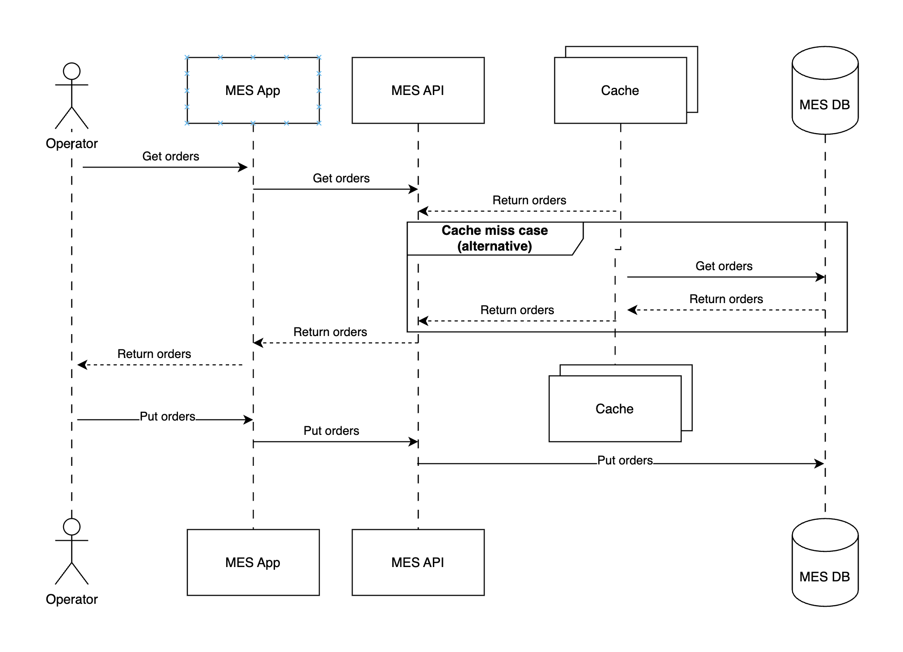

# Задание 5

## Анализ системы

Проведённый анализ показал, что **MES-приложение** является наиболее загруженным элементом. Основная причина — частые обращения операторов к странице заказов. В результате возрастает нагрузка на базу данных и увеличивается время отклика системы.

## Зачем это нужно

Внедрение механизма кэширования позволит:

- Ускорить загрузку страницы заказов для операторов.  
- Снизить количество обращений к базе данных.  
- Повысить комфорт работы пользователей.  
- Улучшить общую производительность приложения.  

Эти доработки положительно повлияют на опыт работы существующих пользователей и будут привлекательны для новых клиентов.

## Объекты для кэширования

В рамках MES-приложения целесообразно кэшировать:

- Список заказов (страница заказов).  
- Информацию о конкретном заказе.  
- Результаты расчёта стоимости заказа.  

## Подход к реализации

Предлагается использовать **серверное кэширование**. Такой вариант даёт централизованный контроль: можно управлять сроком жизни данных, их актуальностью и стратегией обновления.

Так как в MES-приложении преобладают операции чтения, оптимальным будет использование шаблона:

- **Cache-Aside** — при обращении сначала проверяется кэш.  
  - Если данные есть (cache hit) → возвращаются из кэша.  
  - Если данных нет (cache miss) → выполняется запрос к БД, результат сохраняется в кэш и отдаётся клиенту.  

## Обеспечение актуальности данных

Для синхронизации кэша и базы данных предлагается комбинированная стратегия инвалидации:

- **По ключу** — при изменении информации по конкретному заказу (например, обновление статуса или пересчёт стоимости) кэш обновляется точечно по идентификатору заказа.  
- **По времени (TTL)** — для списка заказов используется ограниченный срок жизни данных (например, 10–60 секунд). Такой подход снижает нагрузку на базу и при этом сохраняет достаточную актуальность отображаемого списка.  

## Схема

